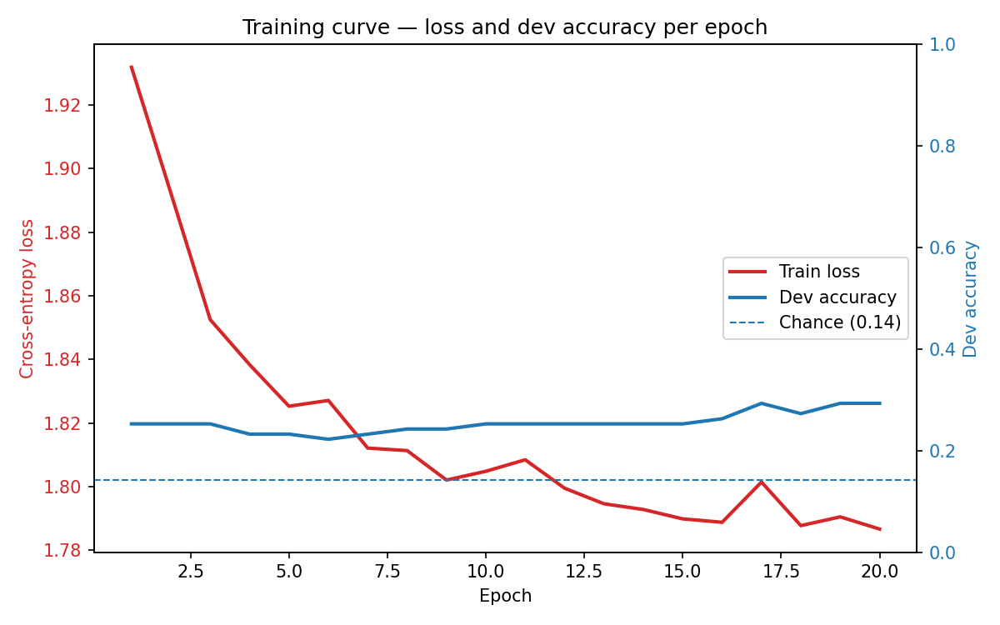

# Asgn3 — Neural Topic Classification for Simplified Chinese

A pipeline that trains FastText character-level embeddings and a feed-forward PyTorch classifier to assign topic labels to Simplified Chinese sentences.

---

## Requirements

```
pip install gensim pandas numpy torch
```

---

## Dataset

Three TSV splits in `data/`, each with columns `index_id | category | text`:

| Split      | Sentences |
|------------|-----------|
| train.tsv  | 701       |
| dev.tsv    | 99        |
| test.tsv   | 204       |

**Topic classes (7):** entertainment, geography, health, politics, science/technology, sports, travel

---

## How to Run

All commands should be run from the project root (`Asgn3-Neural-Topic-Classification-for-Simplified-Chinese/`).
Create the output directories first:

```bash
mkdir -p models embeddings models_sif embeddings_sif
```

---

### Step 1 : Train FastText word embeddings

Train character-level FastText embeddings over all three splits combined.

```bash
python scripts/train_fasttext.py \
    --input_files data/train.tsv data/dev.tsv data/test.tsv \
    --dim 100 \
    --output_model models/fasttext.model
```

| Argument         | Required | Default | Description                          |
|------------------|----------|---------|--------------------------------------|
| `--input_files`  | yes      | —       | One or more `.tsv` files to train on |
| `--dim`          | no       | 100     | Embedding dimensionality             |
| `--output_model` | yes      | —       | Path to save the trained model       |
| `--epochs`       | no       | 5       | Number of training epochs            |
| `--window`       | no       | 5       | Context window size                  |
| `--sg`           | no       | off     | Flag: use skip-gram instead of CBOW  |
| `--workers`      | no       | 4       | Number of worker threads             |

**Tokenisation note:** Both Chinese and Latin/ASCII characters are tokenised at the *character* level — every Unicode code-point becomes one token. This is standard for Chinese since word boundaries are not marked by spaces. Latin characters (e.g. abbreviations, numbers, foreign names) appear in the corpus and are treated identically: each character is its own token. FastText's sub-word n-gram mechanism then learns representations for both scripts.

---

### Step 2 : Compute sentence embeddings

For each sentence in each split: tokenise by character → look up FastText vectors → average them into one vector.

```bash
python scripts/sentence_embeddings.py \
    --model models/fasttext.model \
    --input_files data/train.tsv data/dev.tsv data/test.tsv \
    --output_dir embeddings/
```

| Argument        | Required | Default          | Description                              |
|-----------------|----------|------------------|------------------------------------------|
| `--model`       | yes      | —                | Path to trained FastText model           |
| `--input_files` | yes      | —                | One or more `.tsv` files to convert      |
| `--output_dir`  | no       | same as input    | Directory where `.npz` files are written |

Produces `embeddings/train.npz`, `embeddings/dev.npz`, `embeddings/test.npz`.
Each `.npz` contains three arrays: `embeddings` (N × dim), `labels` (N,), `ids` (N,).

---

### Step 3 : Train the classifier

Train a two-hidden-layer feed-forward network on the training embeddings, validated on dev.

```bash
python scripts/train_classifier.py \
    --train_embeddings embeddings/train.npz \
    --dev_embeddings   embeddings/dev.npz   \
    --output_model     models/classifier.pt \
    --output_labels    models/label_map.json \
    --epochs 20 \
    --batch_size 32 \
    --plot models/training_curve.png
```

| Argument              | Required | Default | Description                                      |
|-----------------------|----------|---------|--------------------------------------------------|
| `--train_embeddings`  | yes      | —       | `.npz` file for training                         |
| `--dev_embeddings`    | yes      | —       | `.npz` file for validation                       |
| `--output_model`      | yes      | —       | Where to save best model weights                 |
| `--output_labels`     | yes      | —       | Where to save label→index JSON                   |
| `--epochs`            | no       | 20      | Number of training epochs                        |
| `--batch_size`        | no       | 32      | Mini-batch size                                  |
| `--hidden_size`       | no       | 128     | Units per hidden layer                           |
| `--dropout`           | no       | 0.3     | Dropout probability                              |
| `--lr`                | no       | 1e-3    | Learning rate                                    |
| `--plot`              | no       | —       | Path to save training curve as `.png` (optional) |

**Architecture:**
```
Input(100) → Linear(128) → ReLU → Dropout(0.3)
           → Linear(128) → ReLU → Dropout(0.3)
           → Linear(7)
           → CrossEntropyLoss
```

The best checkpoint by dev accuracy is saved automatically each epoch.
When `--plot` is provided, a dual-axis training curve is saved showing loss (left axis) and dev accuracy (right axis) per epoch, with a dashed chance-level baseline.


---

### Bonus : SIF embeddings

SIF (Smooth Inverse Frequency) is an alternative weighting scheme for sentence embeddings described in [Arora et al. (2017)](https://openreview.net/forum?id=SyK00v5xx). It has two steps:

1. **Weighted average:** each character token w gets weight `a / (a + p(w))`, where `p(w)` is its relative corpus frequency and `a` is a smoothing constant. Rare characters get higher weight than very common ones.
2. **Common-component removal:** compute the first principal component of all sentence vectors via SVD and subtract each vector's projection onto it. This removes the dominant direction shared by all sentences (a "background" frequency effect).

Activate with `--sif`. Character frequencies are estimated jointly over all input files so the same table and the same PC apply to every split.

```bash
# Step 2 (SIF variant)
python scripts/sentence_embeddings.py \
    --model models/fasttext.model \
    --input_files data/train.tsv data/dev.tsv data/test.tsv \
    --output_dir embeddings_sif/ \
    --sif \
    --sif_a 1e-3

# Step 3 — train on SIF embeddings
python scripts/train_classifier.py \
    --train_embeddings embeddings_sif/train.npz \
    --dev_embeddings   embeddings_sif/dev.npz   \
    --output_model     models_sif/classifier.pt \
    --output_labels    models_sif/label_map.json \
    --epochs 20 --batch_size 32 \
    --plot models_sif/training_curve_sif.png

# Step 4 — evaluate SIF model
python scripts/evaluate.py \
    --model     models_sif/classifier.pt \
    --label_map models_sif/label_map.json \
    --embeddings embeddings_sif/train.npz embeddings_sif/dev.npz embeddings_sif/test.npz
```

| Argument   | Required | Default | Description                              |
|------------|----------|---------|------------------------------------------|
| `--sif`    | no       | off     | Flag: use SIF instead of plain mean      |
| `--sif_a`  | no       | 1e-3    | Smoothing parameter *a* for SIF weights  |



---

### Step 4 : Evaluate

Load the saved model and print accuracy and a confusion matrix for each split.

```bash
python scripts/evaluate.py \
    --model     models/classifier.pt \
    --label_map models/label_map.json \
    --embeddings embeddings/train.npz embeddings/dev.npz embeddings/test.npz
```

| Argument        | Required | Default | Description                           |
|-----------------|----------|---------|---------------------------------------|
| `--model`       | yes      | —       | Path to saved model weights (`.pt`)   |
| `--label_map`   | yes      | —       | Path to label→index JSON              |
| `--embeddings`  | yes      | —       | One or more `.npz` files to evaluate  |
| `--hidden_size` | no       | 128     | Must match the value used in training |

---

## Session Transcript

See [TRANSCRIPT.md](TRANSCRIPT.md) for the full terminal session run on mltgpu.

---

## Results

### Accuracy — Mean embeddings

| Split | Correct | Total | Accuracy | Chance (1/7) | Above chance |
|-------|---------|-------|----------|--------------|--------------|
| train | 176     | 701   | 25.1%    | 14.3%        | YES          |
| dev   | 25      | 99    | 25.3%    | 14.3%        | YES          |
| test  | 51      | 204   | 25.0%    | 14.3%        | YES          |

### Accuracy — SIF embeddings (a = 1e-3)

| Split | Correct | Total | Accuracy | Chance (1/7) | Above chance |
|-------|---------|-------|----------|--------------|--------------|
| train | 192     | 701   | 27.4%    | 14.3%        | YES          |
| dev   | 29      | 99    | 29.3%    | 14.3%        | YES          |
| test  | 54      | 204   | 26.5%    | 14.3%        | YES          |

SIF improves dev accuracy by **+4 percentage points** (25.3% → 29.3%) and test accuracy by **+1.5 pp** (25.0% → 26.5%).

---

## Observations

### Confusion matrix

The most striking feature of the confusion matrices is a severe **majority-class collapse**. `science/technology` is the largest class in the training set (176 out of 701 sentences, ~25%) and `politics` is one of the larger ones (~15%).

- **Mean embeddings:** the model predicts **only one class** — `science/technology` — across every split. All 701 training sentences are assigned to that single label; columns for all other six classes are entirely zero.
- **SIF embeddings:** the model predicts **two classes** — `politics` and `science/technology`. The PC-removal step shifts some probability mass toward politics, but the other five classes remain unpredicted.

All correct predictions come from:
- True `science/technology` sentences predicted as `science/technology` (176 on train for mean; 141 on train for SIF).
- True `politics` sentences predicted as `politics` (51 on train for SIF only; 0 for mean).

Every other class has zero recall. For example, all `travel` sentences (138 on train) are misclassified as `science/technology` under mean embeddings, even though `travel` is the second most common class. This suggests that topic-relevant characters in travel sentences closely resemble those in science/technology sentences at the character mean-vector level.

### SIF vs mean embeddings

SIF produces a modest but consistent improvement over plain mean embeddings on both dev and test. The PC-removal step reduces the influence of the dominant direction common to all sentences (high-frequency characters that appear regardless of topic), which slightly sharpens the separation between classes. However, the same majority-class collapse pattern persists with SIF: the model still predicts only `politics` and `science/technology`. The gain is therefore quantitative (a few more correct predictions within those two classes) rather than qualitative (no new classes become predictable). Obtaining diverse-class predictions would likely require a richer input representation such as contextual embeddings.

### Above-chance performance

With 7 classes, random chance gives 14.3%. The mean-embedding model achieves 25.1% on train, 25.3% on dev, and 25.0% on test — roughly **1.76× chance**. The consistent improvement across all splits (including unseen test data) confirms that the model has genuinely learned something from the training signal and is not merely memorising: the weights were updated in a way that captures real distributional differences between character-level sentence vectors.

That said, the absolute accuracy is poor. The core limitation is the input representation: averaging character vectors into a single fixed-length vector discards word order and sentence structure entirely, and compresses all topic signal into a 100-dimensional mean. A stronger representation — such as sentence-level pooling from a pre-trained Chinese BERT model — would likely yield substantially higher accuracy.
